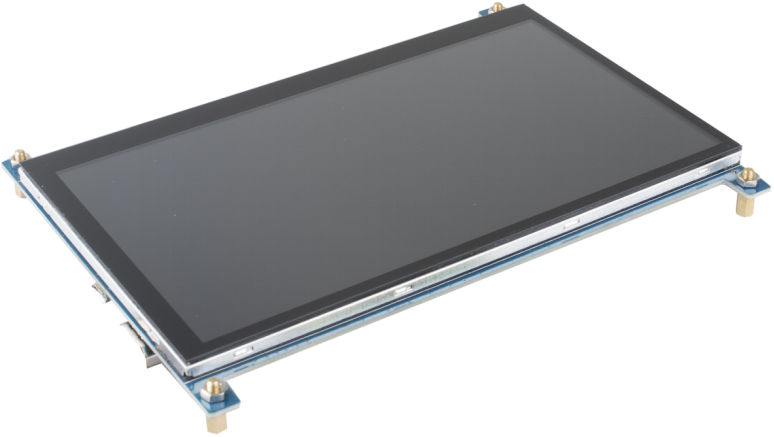
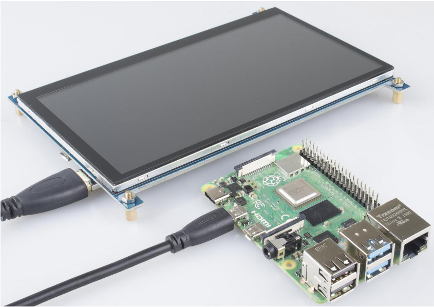
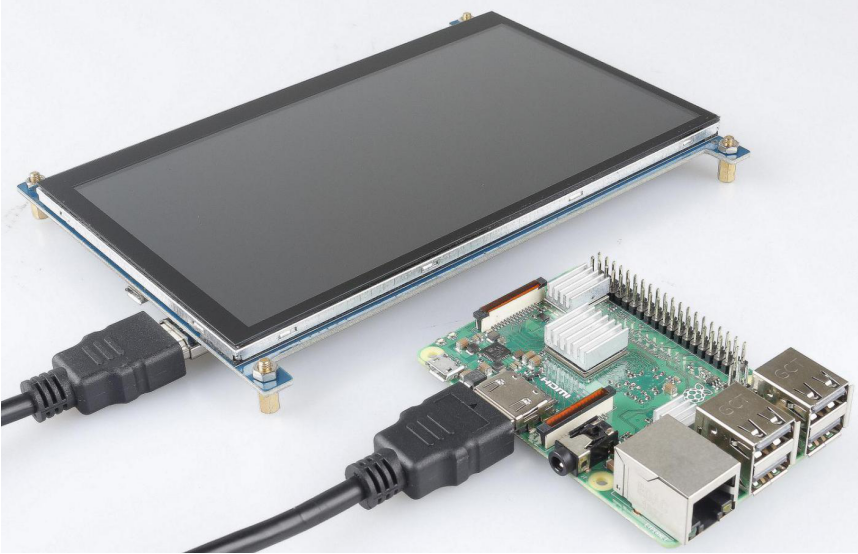
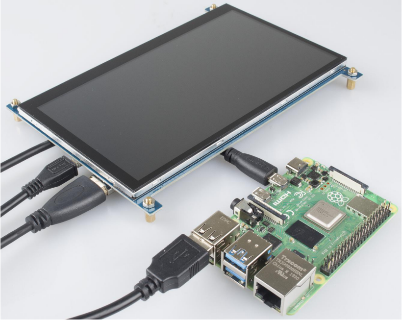
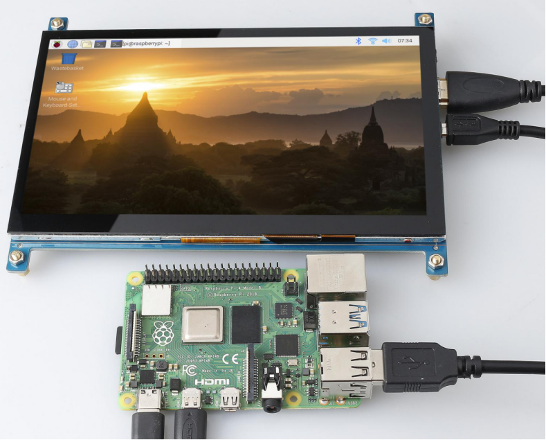

.. note::

    Hello, welcome to the SunFounder Raspberry Pi & Arduino & ESP32 Enthusiasts Community on Facebook! Dive deeper into Raspberry Pi, Arduino, and ESP32 with fellow enthusiasts.

    **Why Join?**

    - **Expert Support**: Solve post-sale issues and technical challenges with help from our community and team.
    - **Learn & Share**: Exchange tips and tutorials to enhance your skills.
    - **Exclusive Previews**: Get early access to new product announcements and sneak peeks.
    - **Special Discounts**: Enjoy exclusive discounts on our newest products.
    - **Festive Promotions and Giveaways**: Take part in giveaways and holiday promotions.

    👉 Ready to explore and create with us? Click [|link_sf_facebook|] and join today!

ASSEMBLY INSTRUCTIONS
========================================

Take out M3 nuts and M3x8+6 single-pass brass standoff to support the 7-inch touch screen.

This 7-inch touch screen is compatible with any version of the Raspberry Pi. 
The kit provides 2 types of HDMI cables, of which HDMI to Micro HDMI cable applies to Raspberry Pi 4 Model B, and the other cable, HDMI to HDMI cable is suitable for Raspberry Pi 3 and the lower versions.

Connect the USB cable to Raspberry Pi.

Plug the USB power supply into a socket and connect it to your Raspberry Pi’s power port, and you may find a red LED lighting up on the Raspberry Pi, which indicates that Raspberry Pi is connected to power. As Raspberry Pi starts up (also called booting), raspberries appears in the top left-hand corner on your screen. After a few seconds, the Raspberry Pi Desktop will appear.

