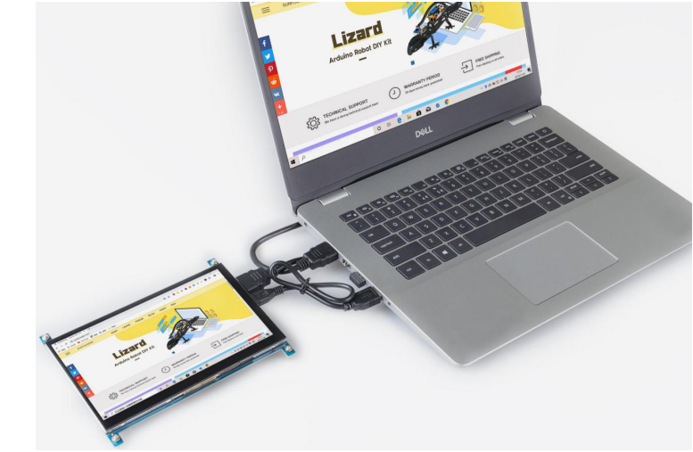

Connect the Screen to the PC
===============================

Connect the computer and the 7-inch touch screen via an HDMI cable and the USB cable. Now you can use the screen as an extension one for your computer. 

