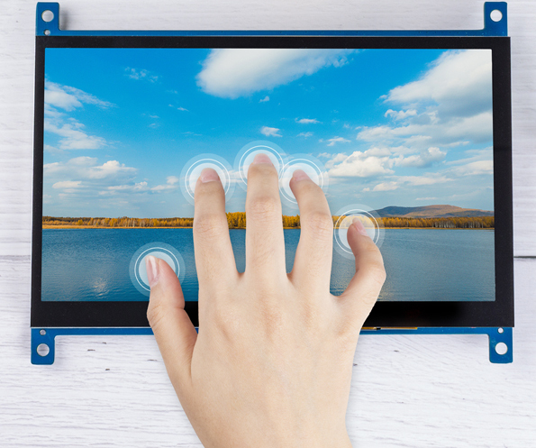

TS-7 7-inch Touch Screen
===============================

7-inch touch screen supports Raspbian/Win7/Win8/Win10(Plug and play), Android/Linux (need to be configured first). 
Equipped with Micro USB and HDMI port support, the screen can be connected to the device via HDMI interface and be powered via USB. Achieving touch function powered by USB doesn’t need power cord or drive-free.

.. toctree::
    :maxdepth: 2

    components_list
    install_the_rpi_os
    assembly_instructions
    quick_user_guide
    projects_and_activities
    connect_the_screen_to_the_pc
    appendix/appendix
    parameters
    faq

Copyright Notice
--------------------------

All contents including but not limited to texts, images, and code in this manual are owned by the SunFounder Company. You should only use it for personal study,investigation, enjoyment, or other non-commercial or nonprofit purposes, under therelated regulations and copyrights laws, without infringing the legal rights of the author and relevant right holders. For any individual or organization that uses these for commercial profit without permission, the Company reserves the right to take legal action.
