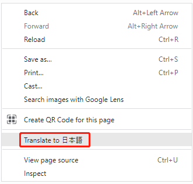
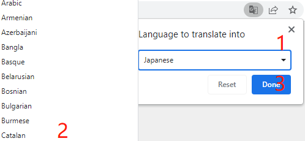

.. note::

    Hello, welcome to the SunFounder Raspberry Pi & Arduino & ESP32 Enthusiasts Community on Facebook! Dive deeper into Raspberry Pi, Arduino, and ESP32 with fellow enthusiasts.

    **Why Join?**

    - **Expert Support**: Solve post-sale issues and technical challenges with help from our community and team.
    - **Learn & Share**: Exchange tips and tutorials to enhance your skills.
    - **Exclusive Previews**: Get early access to new product announcements and sneak peeks.
    - **Special Discounts**: Enjoy exclusive discounts on our newest products.
    - **Festive Promotions and Giveaways**: Take part in giveaways and holiday promotions.

    👉 Ready to explore and create with us? Click [|link_sf_facebook|] and join today!

TS-7 7-inch Touch Screen
===============================

.. image:: img/index.jpg

7-inch touch screen supports Raspbian/Win7/Win8/Win10(Plug and play), Android/Linux (need to be configured first). 
Equipped with Micro USB and HDMI port support, the screen can be connected to the device via HDMI interface and be powered via USB. Achieving touch function powered by USB doesn’t need power cord or drive-free.
Ideal for applications like retro gaming, industrial control, as a secondary monitor, in home automation, for 3D printing control, and as a |link_pc_monitor|.

**About the display language**

In addition to English, we are working on other languages for this course. Please contact service@sunfounder.com if you are interested in helping, and we will give you a free product in return. 
In the meantime, we recommend using Google Translate to convert English to the language you want to see.

The steps are as follows.

* In this course page, right-click and select **Translate to xx**. If the current language is not what you want, you can change it later.

* There will be a language popup in the upper right corner. Click on the menu button to **choose another language**.

.. image:: img/translate2.png
    :align: center

* Select the language from the inverted triangle box, and then click **Done**.

.. toctree::
    :maxdepth: 2

    components_list
    install_the_rpi_os
    assembly_instructions
    quick_user_guide
    projects_and_activities
    connect_the_screen_to_the_pc
    appendix/appendix
    parameters
    faq

Copyright Notice
--------------------------

All contents including but not limited to texts, images, and code in this manual are owned by the SunFounder Company. You should only use it for personal study,investigation, enjoyment, or other non-commercial or nonprofit purposes, under therelated regulations and copyrights laws, without infringing the legal rights of the author and relevant right holders. For any individual or organization that uses these for commercial profit without permission, the Company reserves the right to take legal action.
