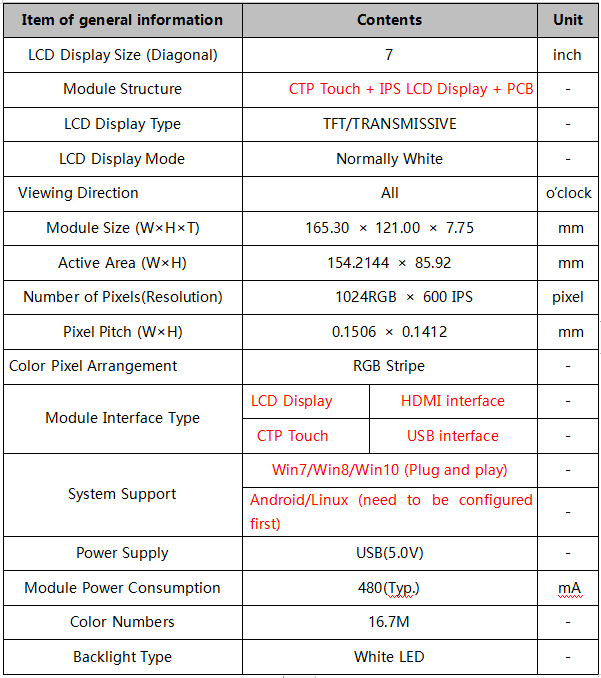
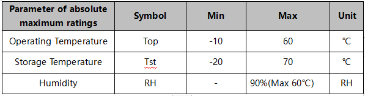
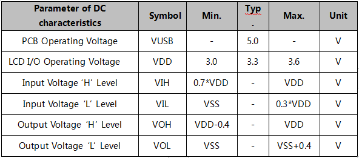
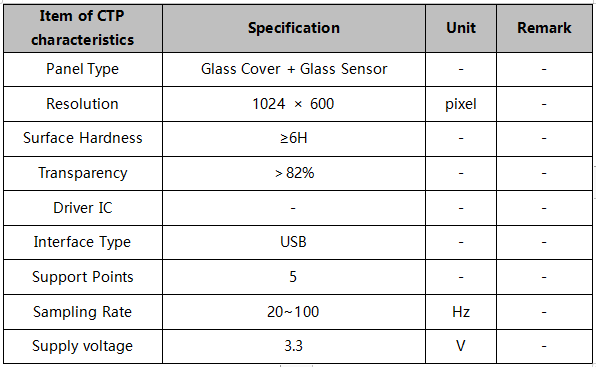
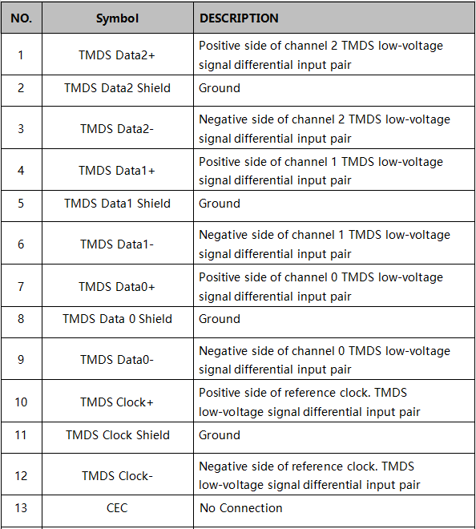
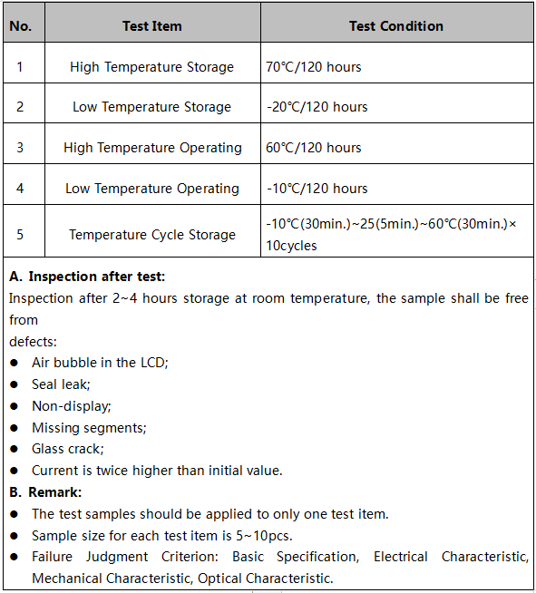

PARAMETERS
=====================

General Information 
---------------------

Absolute Maximum Ratings
---------------------------

.. note::
	Absolute maximum rating means that the product can withstand short-term, not more than 120 hours. If the product takes a long time to withstand these conditions, the life time would be shorter.
	

CTP Characteristics
----------------------

Interface Description
-----------------------

.. image:: img/appendix5.png

HDMI Interface Description
-----------------------------

.. image:: img/appendix7.png

USB Interface Description Application Note: Please connect the USB first, and then connect the HDMI interface.

Reliability Conditions
--------------------------

